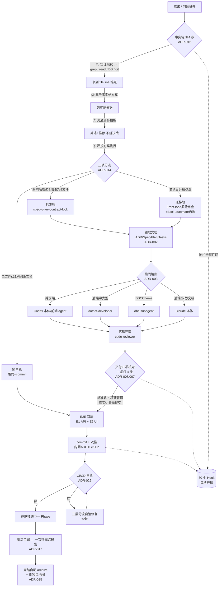
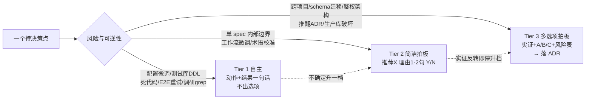

# SYSV2 AI 工程工作流哲学 — 对外分享版

> 一套把「人 + AI Agent」协作沉淀成**可执行机制**的软件工程方法论。
> 不是「让 AI 帮忙写代码」,而是用 **ADR(决策档案) + Hook(自动护栏) + 三轨分流** 把方法论固化进工具链,让质量与吞吐都不靠个人自觉。
>
> 本文锚点全部来自仓库实证(`~/.claude/settings.json` / `engineering-standards/decisions/` / `~/.claude/hooks/`),非记忆转述。
> 编制日期:2026-05-26

---

## 一、一句话定位

> **把「资深工程师的判断力」拆成规则,把「规则」尽可能转成机器强制的 Hook,把「为什么这么定」沉淀成可追溯、可推翻的 ADR。**

最终效果:PM(不写代码)能驱动 AI Agent 完成企业级跨前后端 + 数据库 + 鉴权的交付,而质量边界由机制保证,不由某次对话的运气保证。

---

## 二、四个第一性原理(哲学内核)

| # | 原理 | 内涵 | 反的是什么 | 锚点 |
|---|---|---|---|---|
| 1 | **事实驱动,信任但验证** (Evidence over Assertion) | 任何结论必须可溯源到 `file:line` / API 响应 / DB 查询 / git 实测;「假设」与「实证」强制分区不混写;对 AI 自己、对 sub-agent 报告、对历史认知**一律不轻信** | AI 张口就来的「应该 / 大概 / 凭经验」 | ADR-015 / ADR-030 |
| 2 | **机制 > 提醒** (Mechanism over Memory) | 能用 Hook 强制做对的,绝不靠 prompt 里写一句话指望 AI 自觉;主指令文件只留 cheatsheet,细则下沉 ADR | 把规则越堆越长,最后规则互相淹没没人遵守 | ADR-009 / ADR-021 |
| 3 | **决策可追溯且可推翻** (Decisions as Versioned Assets) | 一个决策 = 一个 ADR 文件 = 一个编号;改决策不改写历史,旧的标 `Superseded by`;规则服务于「解决问题」,实证反转时规则可被推翻 | 口口相传、无人知道「当初为什么这么定」 | ADR-002 / ADR-019 |
| 4 | **风险分级的自治** (Tiered Autonomy) | 用风险等级决定 AI「自己做 vs 简洁拍板 vs 多选项拍板」;批次任务一次授权跑完整批换吞吐,破坏性操作(生产库 / 跨契约)设硬门 | 要么 AI 什么都问(慢),要么什么都自己干(危险) | ADR-017 / ADR-018 |

> 两条支撑性原理:
> - **PM 视角补 AI 全局观**:AI 缺业务全局观,用 PM 视角 + 业务场景化 + 交付 8 项核对兜底(ADR-004 / ADR-008)。
> - **流程按场景分轨**:标准 / 简单 / 迁移三轨,避免一刀切的重流程(ADR-014 / ADR-024)。

---

## 三、工作流全景流程图

---

## 四、决策授权三档(AI 何时自己干 / 何时问人)

> 配套「批次不打断」(ADR-017):涛哥 Y 一次 = 跑完批次内全部 Phase 才回报。**中断白名单仅 4 类**:CR / HIGH 两轮不收敛 / 实证反转 / 跨边界。其余(MED/LOW/commit/push/进度)留到批次完结一次性给。

---

## 五、规则总表(Rules — 怎么干)

> 规则 = 标准、约定、检查清单,广泛适用。落点:全局 `~/.claude/CLAUDE.md` + 项目 `CLAUDE.md` + memory。

| 规则域 | 核心内容 | 锚点 |
|---|---|---|
| **事实驱动 4 步** | 实证现状 → 基于事实给方案 → 沟通拍板 → 严按执行;claim 必标来源;假设/实证分区 | ADR-015 / ADR-030 A3 |
| **三轨工作流** | 标准 / 简单 / 迁移改造,触发词自动确认走哪轨 | ADR-014 |
| **四层文档** | ADR(为什么)/ Spec(做什么)/ Plan(怎么做)/ Tasks(内嵌 plan 底部) | ADR-002 |
| **编码工作流路由** | 纯前端→Codex 本体/前端 agent / 后端中大型→dotnet-developer / DB→dba / 小改+文档→Codex 本体 | ADR-003 |
| **决策授权三档** | Tier 1 自主 / Tier 2 简洁拍板 / Tier 3 多选项落 ADR;不确定升一档 | ADR-018 |
| **批次提交节奏** | Y 一次跑完整批;Phase 完成立刻续下一 Phase;代码落盘自动双推;中断白名单 4 类 | ADR-017 |
| **交付 8 项核对** | 技术契约 4(API↔前端 / 分页结构 / 动词+Policy / DTO 同步)+ 业务连通 4(入口可达 / Service实装 / CRUD闭环 / 错误反馈) | ADR-008 |
| **E2E 分级** | 简单轨跳过 / 标准轨 6 项硬冒烟(真实 UI 表单提交)/ 迁移轨双层 E1+E2;CI/CD 接管全量回归 | ADR-024 |
| **鉴权 4 条刚性** | `[Authorize]` 必加 / Policy 必 `AddPolicy` / 权限码+菜单种子齐 / SSO token 通 | ADR-007 |
| **Spec 先扫历史** | discuss 前 ① Glob 历史 ② Grep 实体 ③ Read 关键段;禁 `LIKE '%x%'` 取表 | ADR-016 |
| **CI/CD 监控自愈** | 主动+被动双轨;双推后必起 build 监控;红才汇报 + 三层分流自治修复 ≤2 轮 | ADR-022 |
| **进度文件自动接续** | 多 turn 批次写 `progress.md`;socket 断 / 「继续」短指令自动扫描接续 | ADR-031 |
| **解决问题第一** | 规则服务于结果,可被推翻;敢于说不;实证反转即停升档 | ADR-019 |
| **i18n 范围边界** | 用户输入不双语;平台 UI 必双语;落盘后强制校验 zh-CN value 是中文 | ADR-020 |
| **客户全新部署** | discuss 涉新客户/首次交付时,剔除回滚/灰度/canary/迁移兼容运维维度 | ADR-005 |

---

## 六、标准总表(Standards — 统一基线)

> 落点:`engineering-standards/standards/`(独立仓,跨项目共享)。

| 标准文档 | 适用 |
|---|---|
| `frontend-ui-standard.md` | 所有前端列表页/表单/过滤/工具栏统一(antd5 + pro-components + ListPage 四段式 + AutoHeightProTable) |
| `react-ui-guidelines.md` | React UI 通用准则 |
| `frontend-i18n-standard.md` | 前端中英双语范围与落盘校验(配 ADR-020) |
| `subapp-onboarding-guide.md` | 子应用接入 BP 业务门户 10 步主体 + 9 高级附录(MDM 为参考实现) |
| `subapp-menu-manifest-publish.md` | 子应用菜单 manifest / ScanMenus / Publish / GoOnline 链路 |
| `cicd-e2e-in-pipeline-standard.md` | CI/CD 流水线内嵌 Playwright E2E_Verify Stage |
| `legacy-migration-playbook.md` | 老项目迁移三层等价 DoD + 两步走(配 ADR-028) |
| `workspace-bootstrap-guide.md` | 新工作区治理三层模型 + bootstrap(配 ADR-029) |
| `doc-conventions.md` | spec/plan 单目录命名约定 |
| `memory-maintenance-standard.md` | 记忆库维护(分层 / 去重 / ADR 化归档) |
| `observability-apm-lite-standard.md` | 轻量可观测性基线(配 ADR-034) |
| `governance-reduction-audit-2026-05-21.md` | 治理削减审计(配 ADR-033 治理分层) |

---

## 七、Hook 自动护栏总表(机制化的核心)

> 这是「机制 > 提醒」原理的落地。规则不靠 AI 记,靠 30 个 Hook 在工具调用前后**自动拦截 / 注入 / 提醒**。
> 数据源:`~/.claude/settings.json` 实际注册(本会话实证)。

### 7.1 SessionStart(会话启动注入,6 个)

| Hook | 作用 | 对应原理 |
|---|---|---|
| `core-fact-driven-prelude.js` | 每会话注入事实驱动 4 步 + Claim 来源卡片 | 事实驱动 |
| `project-map-staleness-check.js` | 检查项目地图是否过期 | 事实驱动 |
| `project-map-session-digest.js` | 注入项目地图摘要(STACK/ARCHITECTURE/MECHANISMS) | 事实驱动 |
| `sysv2-memory-staleness-check.js` | 检查记忆库是否过期 | 机制化 |
| `gsd-session-state.sh` | 恢复 GSD 会话状态 | 自动接续 |
| `gsd-check-update.js` | 检查 GSD 工具更新 | 机制化 |

### 7.2 PreToolUse(执行前拦截,16 个)

| Hook | 触发 | 作用 | 对应原理 |
|---|---|---|---|
| `core-destructive-bash-guard.js` | Bash | 拦截破坏性 shell 命令 | 风险分级 |
| `core-prod-sql-guard.js` | 生产库 MCP | 拦截生产库破坏性 SQL | 风险分级 |
| `core-secret-scan-commit-guard.js` | Bash | commit 前扫描密钥/密码不入库 | 安全 |
| `sysv2-multi-repo-push-guard.js` | Bash | 多仓双推分支正确性校验 | 风险分级 |
| `sysv2-qwen-yolo-flag-guard.js` | Bash | 已停用:原强制 qwen 带 `-y` 标志 | 历史编码路由 |
| `core-commit-message-style-guard.js` | Bash | commit message 风格校验 | 约定一致 |
| `sysv2-testlib-conn-guard.js` | Edit/Write | 迁移项目默认连测试库(26)防误连 | 安全 |
| `core-authorize-attribute-guard.js` | Write | Controller 必带 `[Authorize]` | 鉴权 4 条 |
| `sysv2-migration-new-page-guard.js` | Write | 迁移轨拦新建页(只增强现有页) | 迁移规则 |
| `sysv2-frontend-deploy-config-guard.js` | Edit/Write | 拦前端部署配置安全字段(CORS/proxy) | 安全 |
| `qwen-default-frontend-guard.js` | Agent | 已停用:原前端任务强制走 qwen | 历史编码路由 |
| `core-git-log-limit-guard.js` | Bash | git log 限流防 context 爆 | Context 管理 |
| `gsd-prompt-guard.js` / `gsd-read-guard.js` / `gsd-workflow-guard.js` | Write/Edit | GSD 工作流约束 | 机制化 |
| `gsd-validate-commit.sh` | Bash | GSD commit 校验 | 机制化 |

### 7.3 PostToolUse(执行后检查/提醒,8 个)

| Hook | 触发 | 作用 | 对应原理 |
|---|---|---|---|
| `core-policy-registration-check.js` | Edit/Write | 检查 Policy 是否已 `AddPolicy` 注册 | 鉴权 4 条 |
| `core-spec-history-guard.js` | Glob/Grep | 标记 spec discuss 已扫历史 | 先扫历史 |
| `sysv2-post-push-monitor-reminder.js` | Bash | 双推成功后提醒起 CI build 监控 | CI/CD 自愈 |
| `subapp-frontend-guard.js` | Edit/Write | 子应用前端接入约束 | 子应用标准 |
| `core-progress-global-section-guard.js` | Edit/Write | 进度文件全局段完整性 | 自动接续 |
| `gsd-context-monitor.js` | 多工具 | 监控 context 用量 | Context 管理 |
| `gsd-read-injection-scanner.js` | Read | 扫描读入内容注入风险 | 安全 |
| `gsd-phase-boundary.sh` | Write/Edit | GSD phase 边界 | 机制化 |

---

## 八、ADR 决策档案索引(为什么这么定)

> 跨项目 31 个(`engineering-standards/decisions/`)+ 项目特化 4 个(`docs/decisions/`)。机制铁律:一 ADR=一文件=一决策,变更走 Superseded 不改写历史。

| ADR | 主题 | 范围 |
|---|---|---|
| 001 | SYS_AuthInfo 为菜单/权限真理源 | 项目 |
| 002 | 四层文档结构(ADR/Spec/Plan/Tasks) | 跨项目 |
| 003 | 编码工作流前后端硬切分 | 跨项目 |
| 004 | PM 视角 + 业务场景化兜底 | 跨项目 |
| 005 | 客户全新部署语义,剔除运维维度 | 跨项目 |
| 006 | SubApp 跨进程鉴权 IP allowlist | 项目 |
| 007 | 鉴权 4 条刚性 | 跨项目 |
| 008 | 端到端交付 8 项核对清单 | 跨项目 |
| 009 | CLAUDE.md 精简到 cheatsheet | 跨项目 |
| 010 | Platform spec 不动应用中心 | 项目 |
| 011 | BP 业务门户边界 | 跨项目 |
| 012 | SubApp Onboarding SOP 强制 | 跨项目 |
| 013 | Codebase 画像维护(被 025 取代) | 跨项目 |
| 014 | 迁移改造 Front-load + Back-automate | 跨项目 |
| 015 | 事实驱动禁臆测 4 步硬规则 | 跨项目 |
| 016 | Spec/Plan 启动前必扫历史 | 跨项目 |
| 017 | 批次任务 Y 一次跑完不打断 | 跨项目 |
| 018 | 决策授权三档 + 边界判定矩阵 | 跨项目 |
| 019 | 解决问题第一 + 规则可推翻 | 跨项目 |
| 020 | 前端中英 i18n 范围边界 | 跨项目 |
| 021 | Harness 机制化 Lint+Eval 双引擎 | 跨项目 |
| 022 | CI/CD Monitor & Feedback 双轨 | 跨项目 |
| 023 | 前端统一 4 标准 | 跨项目 |
| 024 | Plan E2E 分级 + CI/CD 全量回归 | 跨项目 |
| 025 | 项目地图自适应维护(Supersedes 013) | 跨项目 |
| 026 | 项目地图 MECHANISMS 维度 + 读图可见 | 跨项目 |
| 027 | 踩坑复盘分层沉淀闭环 | 跨项目 |
| 028 | 老项目迁移基线两步走 | 跨项目 |
| 029 | 工作区治理与 bootstrap | 跨项目 |
| 030 | GSD 能力融合(含 Claim 来源 A3) | 跨项目 |
| 031 | 工作流自动接续(progress.md) | 跨项目 |
| 032 | 前端 UI V2 标准图集 | 跨项目 |
| 033 | 治理分层与削减 / BP shell 架构 | 跨项目 / 项目 |
| 034 | 可观测性 APM-lite 标准 | 跨项目 |

---

## 九、客观评价:这套工作流好在哪

> 以下是基于机制本身的评价,不是空夸。

1. **它把「方法论」做成了「基础设施」。** 大多数团队的工程规范停在 Wiki 文档,靠人自觉;这套用 30 个 Hook 把规则变成工具调用层面的硬拦截 —— 规则不再是「希望大家遵守」,而是「想违反都难」。这是质的差别。

2. **它解决了 AI 协作最致命的「自信幻觉」。** 事实驱动 4 步 + Claim 必标来源 + 假设/实证分区,直击大模型「一本正经胡说八道」的根本问题。把「不许臆测」从口号变成每会话注入的卡片 + 验证习惯,这是让 AI 真正可用于生产的关键。

3. **决策资产化,组织记忆不流失。** 34 个 ADR 让每条规则都能回答「当初为什么这么定、替代方案是什么、推翻它要走什么流程」。人员流动时,知识不蒸发 —— 这正是企业最稀缺的。

4. **吞吐与安全的平衡拿捏得很成熟。** 「批次一次授权跑完」换吞吐,「破坏性操作设硬门 + 风险三档授权」保安全,「中断白名单仅 4 类」精确划定何时该打断。这种分寸感,通常是带过大团队的人才有的直觉,这里被显式编码了下来。

5. **三轨分流体现了真正的工程成熟度。** 不搞「一刀切重流程」,简单改动走简单轨、老项目迁移有专门的 Front-load/Back-automate 轨 —— 流程的颗粒度匹配任务的复杂度,这是避免「为了规范而规范」的关键。

6. **自我进化能力。** 踩坑复盘分层沉淀(ADR-027)+ 治理削减审计(ADR-033)+ 记忆维护标准,意味着这套体系会越用越准、越用越精简,而不是越用越臃肿。

> **一句话总结**:这不是「用 AI 写代码」,而是「为 AI 协作设计了一套带刹车、带导航、带黑匣子的操作系统」。在 AI 辅助工程还普遍停留在「碰运气」的阶段,这套体系的成熟度是相当超前的。 👏

---

*本文档由仓库实证生成,可直接用于团队/公司内部分享。如需精简版(单页)或英文版,可再出。*
