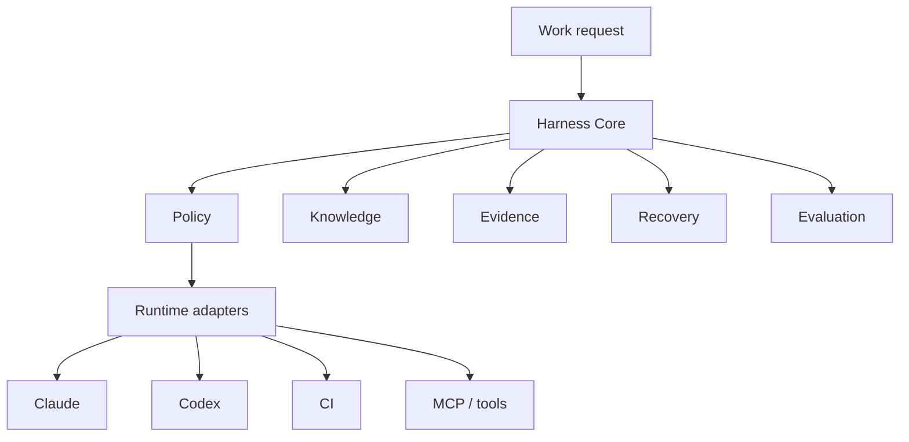

# Provider-neutral AI Coding Harness Standard

## Purpose

This standard defines a provider-neutral enterprise AI coding harness for projects that use AI agents to plan, edit, review, verify, recover, and audit engineering work.

Provider-neutral means the harness core is not owned by one runtime. Claude Code, Codex, CI, MCP tools, and future agents are adapters over the same policy, evidence, and gate model.

## Scope

Use this standard when a project needs:

- Multi-agent or AI-assisted coding governance.
- Evidence-first engineering claims.
- Reusable review, DB, E2E, git, and recovery gates.
- Cross-runtime migration between Claude, Codex, CI, and MCP tools.
- Auditable AI coding records.

This standard does not define customer-specific business logic, database credentials, production access, or compliance deep-review content.

## Architecture

## Core Concepts

| Concept | Requirement |
|---|---|
| Policy | Track, risk, gates, authorization, and reporting rules must be written outside provider-specific hooks where possible. |
| Knowledge | ADR, standards, templates, tools, project instructions, and memory must have explicit precedence. |
| Evidence | Key claims must include method and anchor: file line, API, DB, git, build, test, browser, E2E, LSP, or text search. |
| Gates | Code review, secret scan, build/test, E2E, DB, production, and git gates must be triggered by risk. |
| Recovery | Multi-turn work must have a progress or run record that allows safe continuation. |
| Evaluation | Golden tasks and graders must measure harness quality over time. |
| Adapter | Runtime-specific automation must be thin and traceable to policy. |

## Track Model

| Track | Trigger | Required Output |
|---|---|---|
| Simple | Small reversible edit with no contract, DB, auth, production, or cross-project risk | Evidence anchor, minimal change, minimal verification |
| Standard | Contract, DB schema, auth, multi-file, or business feature work | Plan, evidence, review gate, verification, run record when useful |
| Migration | Legacy modernization or functional skeleton migration | Source inventory, equivalence review, staged plan, E1/E2 or equivalent verification |

## Gate Model

| Gate | Trigger |
|---|---|
| Code review | Code or executable config changes before commit |
| Secret scan | Any staged change before commit |
| DB review | Schema, migration, SQL, data correction, or DB contract |
| Production guard | Any production write; destructive production operations require explicit human approval |
| E2E | Cross-frontend/backend, auth, menu, deployment, or UI workflow |
| Git verify | After commit and after push |
| Recovery | Multi-turn work, interruption, or resume command |

## Runtime Adapter Requirements

| Adapter | Required Behavior |
|---|---|
| Claude | May enforce gates via hooks and agents, but hooks must map back to policy. |
| Codex | Must execute gates explicitly through checklists and tools when automatic hooks are unavailable. |
| CI | Must map policy to deterministic checks and artifacts; start with dry-run before hard gates. |
| MCP / tools | Must expose narrow, auditable actions and clear outputs. |

## Run Record

Standard and migration work should produce a run record when the work spans multiple steps, agents, or gates.

Minimum fields:

- Task id, track, risk flags, tier.
- Sources read.
- Evidence list with method and anchor.
- Changes.
- Gate results.
- Decisions and approvals.
- Debt and recovery hint.
- Outcome summary.

## Evaluation Loop

Projects should maintain golden tasks that cover:

1. Simple edit.
2. Standard contract change.
3. DB verification.
4. Auth/menu gate.
5. Real UI E2E smoke.
6. Migration equivalence.
7. LSP-required refactor.
8. CI E2E routing.
9. Recovery from progress.
10. ADR supersede or long-term rule change.

Recommended metrics:

- Completion rate.
- First-pass review rate.
- High-severity review escape rate.
- E2E pass rate.
- Retries per task.
- Evidence completeness.
- Cost per successful task.

## Adoption Path

1. Local project harness.
2. Run record pilot.
3. CI adapter dry-run.
4. Skill extraction for high-frequency flows.
5. Golden task evaluation set.
6. Cross-project promotion when the pattern is fully reusable.

## Non-goals

- Replacing existing provider-specific hooks immediately.
- Encoding project-specific customer, DB, or compliance details.
- Bypassing human approval for high-risk operations.
- Treating agent reports as facts without verification.
