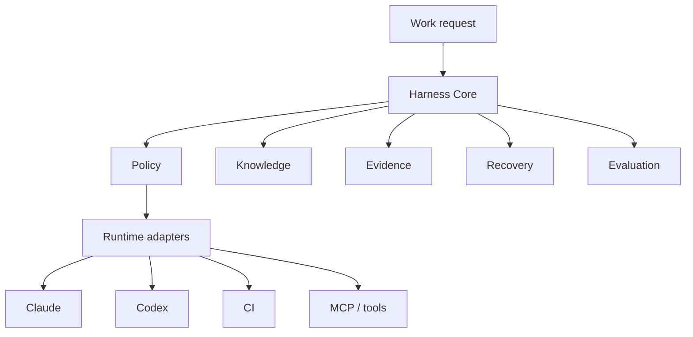

# Provider-neutral AI Coding Harness Standard

## Purpose

This standard defines a provider-neutral enterprise AI coding harness for projects that use AI agents to plan, edit, review, verify, recover, and audit engineering work.

Provider-neutral means the harness core is not owned by one runtime. Claude Code, Codex, CI, MCP tools, and future agents are adapters over the same policy, evidence, and gate model.

## Scope

Use this standard when a project needs:

- Multi-agent or AI-assisted coding governance.
- Evidence-first engineering claims.
- Reusable review, DB, E2E, git, and recovery gates.
- Cross-runtime migration between Claude, Codex, CI, and MCP tools.
- Auditable AI coding records.

This standard does not define customer-specific business logic, database credentials, production access, or compliance deep-review content.

## Architecture

## Core Concepts

| Concept | Requirement |
|---|---|
| Policy | Track, risk, gates, authorization, and reporting rules must be written outside provider-specific hooks where possible. |
| Knowledge | ADR, standards, templates, tools, project instructions, and memory must have explicit precedence. |
| Evidence | Key claims must include method and anchor: file line, API, DB, git, build, test, browser, E2E, LSP, or text search. |
| Gates | Code review, secret scan, build/test, E2E, DB, production, and git gates must be triggered by risk. |
| Recovery | Multi-turn work must have a progress or run record that allows safe continuation. |
| Evaluation | Golden tasks and graders must measure harness quality over time. |
| Adapter | Runtime-specific automation must be thin and traceable to policy. |

## Operating Baseline v1

This baseline is the cross-workspace default for enterprise AI coding work. Project-level `AGENTS.md` files may specialize commands, repositories, credentials, and validation surfaces, but should not redefine the core model.

| Layer | Default |
|---|---|
| Main session | Owns requirement framing, source-of-truth decisions, plan/spec approval, risk escalation, review synthesis, and final acceptance. |
| Child execution | Uses CLI, `codex exec`, CI jobs, or bounded agents for implementation, logs, builds, tests, and structured audits. |
| Project instructions | Keep repo layout, commands, verification, and do-not rules near the code in `AGENTS.md`; avoid long SOPs. |
| Standards | Keep cross-project principles, reusable gates, templates, and evaluation rules in `engineering-standards`. |
| Skills | Keep repeated procedural workflows, especially migration, onboarding, BP auth/menu, CI triage, and harness audits. |
| Hooks/rules/CI | Enforce mechanical checks: secret scan, destructive command guard, pull-before-push, production write guard, migration verify, and review gates. |
| Memory | Helps recall preferences and pitfalls; it is never the only source for required policy or current facts. |

## Multi-Repo Preflight

Standard, migration, cross-repo, DB, auth, production, deployment, and long-running tasks must start with a workspace preflight before edits:

| Check | Evidence |
|---|---|
| Workspace root | `pwd` and expected workspace path. |
| Active repo | `git rev-parse --show-toplevel` from the target directory. |
| Repository role | root workspace, nested application repo, docs/standards repo, or external reference repo. |
| Remote and branch | `git remote -v`, `git status -sb`, and target branch. |
| Dirty state | local changes classified as user/Codex/generated/unknown before edits. |
| Instruction chain | nearest `AGENTS.md` plus relevant global/project standards. |
| Verification plan | build/test/E2E/DB/API/browser/CI commands that match the risk track. |

Do not claim commit, push, sync, deployment, or CI closure from the action command itself. Use independent verification commands.

## Project Map / Codebase

Keep `.planning/codebase/` when a workspace already uses it. It is a navigation and mechanism map, not the final source of current truth.

| Rule | Requirement |
|---|---|
| Role | Use the project map to understand topology, major mechanisms, risks, and likely source-of-truth files before standard, migration, or spec/plan work. |
| Boundary | Do not use stale project-map text as final evidence for key claims; verify against code, DB, API, build, browser, E2E, git, or LSP. |
| Staleness | Session-start time staleness reminder threshold is 15 days. If the map is stale or drifted and the current task touches that scope, refresh the affected map sections or explicitly record the staleness and residual risk. |
| Refresh | After substantial plan/spec/migration work, update affected maps only, preserve unrelated domains, update `MECHANISMS.md` for new mechanism knowledge, and stamp per-repo mapped heads in multi-repo workspaces. Do not rewrite the whole codebase map just because a reminder fired. |

## Code Navigation

Symbol-level code claims must use a semantic navigation adapter when the task risk warrants it.

| Query type | Default |
|---|---|
| C# class/method/property references, definitions, implementations, call chains, rename impact | Use an LSP adapter such as `lsp-nav` against the specific solution. |
| Cross-repository contract or migration analysis | Use bounded child execution or subagents per repository, with LSP where available and main-session synthesis. |
| Text, config, route strings, docs, SQL, JSON, comments, file discovery | Use text search. |
| Compiler correctness | Use the language build/test command, not LSP alone. |

If LSP is unavailable, use text search plus line reads and mark the evidence as `text_search`, not `lsp`; high-risk work should continue to a build/test or another semantic proof before claiming completion.

## Track Model

| Track | Trigger | Required Output |
|---|---|---|
| Simple | Small reversible edit with no contract, DB, auth, production, or cross-project risk | Evidence anchor, minimal change, minimal verification; one staged-diff review for code/executable config, zero agent review for ordinary docs/text |
| Standard | Contract, DB schema, auth, multi-file, or business feature work | Complete contract lock, coverage record, plan, evidence, review gate, verification, run record when useful |
| Migration | Legacy modernization or functional skeleton migration | Complete baseline lock, source/equivalence matrix, coverage record, staged plan, E1/E2 or equivalent verification |

### Scope Completeness Gate for Standard and Migration Tracks

- Do not let an agent downgrade known or agreed scope into an MVP, minimal demo, reduced field set, happy-path-only slice, fixture shell, or placeholder integration. An explicitly approved prototype or phase is allowed only when the complete known target and remaining contract items stay recorded and it is not reported as overall completion.
- Standard-track contract lock must cover the maximum verified union within the agreed affected business boundary: roles, scenarios, fields, actions, states, exceptions, integrations, menu/auth entry points, and acceptance cases evidenced by the request, supplied artifacts, and current code/DB/API behavior.
- Migration-track baseline and equivalence matrices must enumerate the complete source surface page by page, action by action, field by field, API by API, menu by menu, and data rule by data rule, while preserving non-conflicting target enhancements. A migrated subset is not an equivalent migration.
- Phased implementation is allowed only after the full contract is locked. For a single-batch task, the spec acceptance matrix may serve as the coverage record; a separate ledger is required only for multi-batch work. Every tracked contract item has a stable ID, batch assignment, acceptance case, evidence, and one of `covered`, `pending`, `blocked`, or `approved-defer`. Missing external dependencies default to `blocked` and become `approved-defer` only after explicit user approval. A batch is `batch-complete` when all items it committed to are covered. The module is `in-progress` during execution, `partial` after a batch closes while any total-contract item is not covered, and `complete` only when no items remain. If the user explicitly redefines the baseline, `approved-defer` items move with decision/evidence pointers to a parent or backlog ledger and are never silently deleted.
- When an external contract is unavailable, internally owned capabilities independent of that contract must be complete. Fields, states, mappings, and write requests that depend on the missing contract must not be guessed. Existing or contractually required user-visible entry points provide disabled state, pending/error feedback, and no-fake-success behavior; a task with no UI surface instead provides a stable capability state or error code plus audit evidence. External-related items keep the module from overall completion until closed or explicitly moved by a baseline decision.
- This is a business-scope completeness rule, not permission for unrelated features or abstractions. Reuse and the smallest necessary code change remain the implementation default.

## Gate Model

| Gate | Trigger |
|---|---|
| Preflight | Standard, migration, cross-repo, DB, auth, production, deployment, or long-running task |
| Scope completeness | Before implementation, lock the complete contract/baseline and coverage record (spec acceptance matrix for one batch, separate ledger for multiple batches); before batch closure, require all batch-committed items covered; before module completion, require zero `pending`, `blocked`, or `approved-defer` items. A rebaseline moves deferred items with decision/evidence pointers to a parent or backlog ledger |
| Code review | Code or executable config changes: minimal verification, stage the final candidate, then one primary review bound to the staged diff before commit |
| Secret scan | Any staged change before commit |
| DB review | Schema, migration, SQL, data correction, or DB contract |
| Production guard | Any production write; destructive production operations require explicit human approval |
| E2E | Cross-frontend/backend, auth, menu, deployment, or UI workflow |
| Git verify | After commit and after push |
| Recovery | Multi-turn work, interruption, or resume command |

Gate results should be evidence records, not prose assertions. If a gate is intentionally skipped, record the reason, owner, and residual risk.

### Risk-triggered review routing

- Use one primary reviewer per independently deliverable staged batch. A language, DB, architecture, or security specialist replaces the generic reviewer; it is not added by default.
- Add a second focused review only for a second independent high-risk domain, unresolved CRITICAL/HIGH findings, scope expansion, or substantial rework. File count alone is not an architecture-review trigger.
- Ordinary docs, text, and non-executable configuration need deterministic checks but no reviewer agent. Long-lived business contracts and ADRs use one risk-appropriate primary reviewer; dual review is reserved for external/irreversible contracts, auth/compliance, or destructive production/DB decisions.
- A review receipt must bind reviewer completion, PASS verdict, repository, and the staged diff hash. Starting a reviewer, completing an implementation agent, or modifying the staged diff after review cannot satisfy the gate.
- Static contract review and real UI E2E cover different failure modes; retaining both where required is not duplicate review.

### Adaptive migration completeness and adversarial review

- Run deterministic inventory, reference, field, route, menu, API, schema, build, and E2E gates first. Deterministic failures block directly and do not vote.
- Run one independent critic over the normalized manifest and evidence delta. If it finds a gap, the source/contract changes, or the unit is Tier 3 high risk, resolve the finding and run another focused critic; the final critic round must be dry.
- Require two distinct evidence-lens votes only when a claim is both non-deterministic and high impact, including source/ref selection, exclusion, semantic conflict, customer integration, half-finished source classification that changes scope, and irreversible DB decisions. Both must confirm; any refutation keeps the claim disputed.
- Ordinary `migrate-equivalent` and mechanically proven rows do not vote. A third vote is not a default tie-breaker; unresolved evidence conflict returns to the human decision owner.
- Keep one final code review per migration batch plus E1/E2. Baseline adversarial review validates source truth; final code review validates implementation, so they are not interchangeable.

## Runtime Adapter Requirements

| Adapter | Required Behavior |
|---|---|
| Claude | May enforce gates via hooks and agents, but hooks must map back to policy. |
| Codex | Must execute gates explicitly through checklists and tools when automatic hooks are unavailable. |
| CI | Must map policy to deterministic checks and artifacts; start with dry-run before hard gates. |
| MCP / tools | Must expose narrow, auditable actions and clear outputs. |

## CI Background Monitoring

After a push starts CI, monitor the pipeline to a terminal state without occupying the interactive session.

| Rule | Requirement |
|---|---|
| Default mode | Start the CI watcher in a detached/background process or project automation, then keep the main session available for new user prompts. |
| Evidence | Record the repo, branch, build/run id, background PID or automation id, log path, and command used to start monitoring. |
| Startup acceptance | Within 60 seconds or two poll intervals, independently verify that the watcher is still alive and has advanced its log/meta state, or that it has already written a terminal result. Starting a process is not evidence that monitoring works. |
| Transport resilience | Treat transient CI API/network errors as monitor warnings: retry and continue until the overall timeout. Record `monitor_error` separately from a real CI `failed` result; never report one as the other. |
| Output policy | Stay silent for `queued`, `pending`, and `inProgress` states. Report only `FINAL: succeeded/failed`, failed-step log summaries, self-heal actions, or decisions requiring human input. |
| Foreground waits | Use blocking `wait` only for short CI checks or when the user explicitly asks to wait in the foreground. If it starts affecting interaction, stop the foreground wait and restart it in the background. |
| Log handling | Write watcher logs outside source trees unless the project has an approved run-record/log directory; do not commit generated CI logs. |
| Failure artifacts | On a red terminal state, automatically fetch the failed job/task log body, redact secrets, and write a non-empty per-build failure artifact plus per-build alert metadata. A log URL alone is insufficient. |
| Delivery bridge | A detached watcher must have a verified consumer: thread/project automation, event bridge, or an active agent follow-up that reads terminal/alert metadata. A file-writing child with nobody consuming the result is not closed-loop monitoring. |
| Failure path | On failure, the consumer must inspect the captured logs, classify whether self-heal is safe, apply the normal review/verification gates before repush, and restart background monitoring after the fix. |

Preferred implementation order:

1. Project-provided `background` subcommand that starts the watcher with a detached process and records PID/log/meta state, e.g. `node docs/ops/cicd-ado-monitor.js background <repo> --build-id <id>` or SRMV2's `node docs/ops/codex-ci-heartbeat.js background <repo> --build-id <id>`.
2. Codex thread/project automation when the monitor should wake the same conversation or run on a schedule.
3. Shell job under `tmux`/platform-native watcher when already standard for the project.
4. `nohup <ci-watch-command> ... &` only as a fallback after verifying in the current tool environment that the child process survives the parent command/session.

Do not treat a foreground `watch`/`wait` command wrapped in chat as background monitoring. Do not mark CI monitoring complete from the launch command alone, an existing PID alone, or a global “current” file shared by concurrent builds. The mechanism must be tested once per workspace/runtime family, including a completed green replay, a completed red replay with non-empty captured logs, and one transient transport failure.

## Codex Surface Model

Codex baselines should follow the official surface split. Repeated workflow should move to the narrowest durable surface that matches its scope instead of accumulating in chat or a single global instruction file.

| Surface | Use for | Avoid |
|---|---|---|
| Prompt/thread | One-off constraints, current task goals, temporary assumptions | Long-lived team rules |
| `AGENTS.md` | Durable repo/team conventions, commands, verification, review expectations, local overrides | Long SOPs, historical debates, generated logs |
| `~/.codex/config.toml` / project `.codex/config.toml` | Personal or project defaults: model, sandbox, MCP, features, instruction fallback, trusted repo behavior | Business rules or task-specific process |
| Skill | Repeated multi-step workflows, procedural standards, reusable scripts/references | Rules that must always load before every task |
| MCP / connector | Live external data/actions, private workspace systems, DB/API access with auditable outputs | Static knowledge that belongs in docs |
| Hook | Mechanical lifecycle gates: secret scan, commit guard, force-push block, production write guard | Complex judgment, noisy reminders, broad policy prose |
| Automation | Scheduled audits, recurring checks, long polling, stale-state reminders | High-risk unattended writes without sandbox/rules |
| `codex exec` | CI/scripted runs, JSONL/schema output, log summarization, repeatable audit reports | Interactive product decisions needing user context |
| Review | Diff/PR/commit review and regression risk finding | Implementation work or unverified agent assertions |
| Memory | Stable preferences and local recall | Required team rules, current external facts, secrets |

**Baseline rule**:when the same instruction or workflow repeats twice, decide whether it belongs in `AGENTS`, config, skill, MCP, hook, automation, `codex exec`, review, or memory. Promote it there, then remove duplicated prose from chat-era rules.

## Codex Official-Practice Audit

Run an official-practice audit before changing global Codex workflow or at least monthly:

1. Refresh the Codex manual through the official OpenAI docs route.
2. Compare current `~/.codex/AGENTS.md`, `~/.codex/config.toml`, hooks, skills, plugins, memory bridges, and project `AGENTS.md` against the surface model above.
3. Report official evidence, current drift, recommended surface, changes made, and intentionally retained deviations.
4. Put long-lived decisions in ADR/standards; put executable recurring audit steps in a skill or automation.
5. Use `codex exec --json` or an output schema when the audit must feed CI, dashboards, or monthly trend reports.

## Run Record

Standard and migration work should produce a run record when the work spans multiple steps, agents, repositories, or gates.

Run record is mandatory for:

- Migration track.
- Cross-repository implementation or verification.
- DB schema, auth, production, deployment, or CI self-heal risk.
- Work expected to span multiple turns or require resume.
- Work involving multiple agents or `codex exec` child runs.

Minimum fields:

- Task id, track, risk flags, tier.
- Preflight facts for each touched repository.
- Sources read.
- Evidence list with method and anchor.
- Changes.
- Gate results.
- Decisions and approvals.
- Debt and recovery hint.
- Outcome summary.

Use `progress.md` for human-readable continuation and `run-record.template.json` when the task needs machine-readable audit or downstream reporting.

## Evaluation Loop

Projects should maintain golden tasks that cover:

1. Simple edit.
2. Standard contract change.
3. DB verification.
4. Auth/menu gate.
5. Real UI E2E smoke.
6. Migration equivalence.
7. LSP-required refactor.
8. CI E2E routing.
9. Recovery from progress.
10. ADR supersede or long-term rule change.

Recommended metrics:

- Completion rate.
- First-pass review rate.
- High-severity review escape rate.
- E2E pass rate.
- Retries per task.
- Evidence completeness.
- Cost per successful task.

## Adoption Path

1. Local project harness.
2. Run record pilot.
3. CI adapter dry-run.
4. Skill extraction for high-frequency flows.
5. Golden task evaluation set.
6. Cross-project promotion when the pattern is fully reusable.

## Non-goals

- Replacing existing provider-specific hooks immediately.
- Encoding project-specific customer, DB, or compliance details.
- Bypassing human approval for high-risk operations.
- Treating agent reports as facts without verification.
